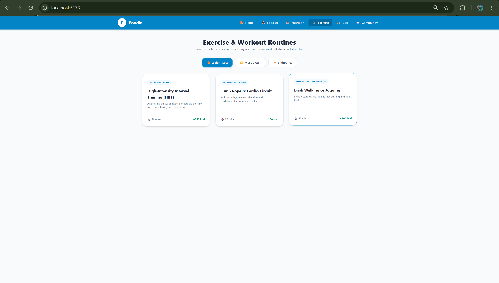

# 🥗 NutriScan-AI: Smart Food Detection & Fitness Ecosystem

NutriScan-AI is a high-fidelity, modular, light-themed full-stack web application designed to bridge AI-powered food recognition with personalized nutrition tracking and comprehensive fitness management. 

---

## ✨ Key Features & Modules

* **🏠 Home Dashboard**: Interactive overview with quick access shortcuts to all app features, metric summaries, and developer credentials.
* **🤖 Food AI Detection**: Step-by-step intake wizard for uploading/selecting processed dataset images to analyze macronutrients via integrated computer vision models.
* **🥗 Nutrition Plans**: Budget-based and customized dietary plans structured around Indian and global cuisines.
* **🏋️‍♂️ Exercise Routines**: Goal-based fitness module (**Weight Loss**, **Muscle Gain**, **Endurance**) featuring interactive detail popups with warm-up stretches, sets, and calorie-burn metrics.
* **⚖️ BMI Calculator**: Real-time body mass index calculation based on custom height and weight inputs.
* **💬 Community & Developer Contact**: Interactive feedback section paired with direct links to developer profiles and socials.

---

## 🛠️ Tech Stack

* **Frontend**: React (Vite), Tailwind CSS, Modern Glassmorphic UI/UX
* **Backend**: Python, Flask, FastAPI, OpenCV, PyTorch, EfficientNet-B0 (for image analysis)
* **Database & Storage**: SQLite, Hive, Relational SQL structures
* **Deployment & Version Control**: Git, GitHub

---

## 👨‍💻 Developer & Contact

Developed by **Pranav M**

* **Email**: [mathampranav@gmail.com](mailto:mathampranav@gmail.com)
* **Phone**: +91 8431032065
* **LinkedIn**: [pranav-matham](https://www.linkedin.com/in/pranav-matham/)
* **Instagram**: [@pranav_m__004](https://www.instagram.com/pranav_m__004?stkn=MXB0OXIyZjFrZmVrag%3D%3D)

---

## 🚀 Getting Started Locally

1. **Clone the repository**:
   ```bash
   git clone [https://github.com/PRANAV-MS25/NutriScan-AI.git](https://github.com/PRANAV-MS25/NutriScan-AI.git)

2.Run the Frontend:

Bash
cd Frontend
npm install
npm run dev

3. Run the Backend:

Bash
cd Backend
pip install -r requirements.txt
python main.py

-------

## 📸 UI Preview & Dashboard Walkthrough

| **Smart Dashboard** | **AI Food Recognition** | **Nutrition Analytics** |
| :---: | :---: | :---: |
|  |  |  |
| *Overview of daily intake and metrics* | *Dynamic visual meal recognition scanner* | *Detailed macro breakdowns and targets* |

| **Community Hub** | **Workout & Fitness Planner** |
| :---: | :---: |
|  |  |
| *Engage, share thoughts, and connect* | *Manage workouts and active routines* |
