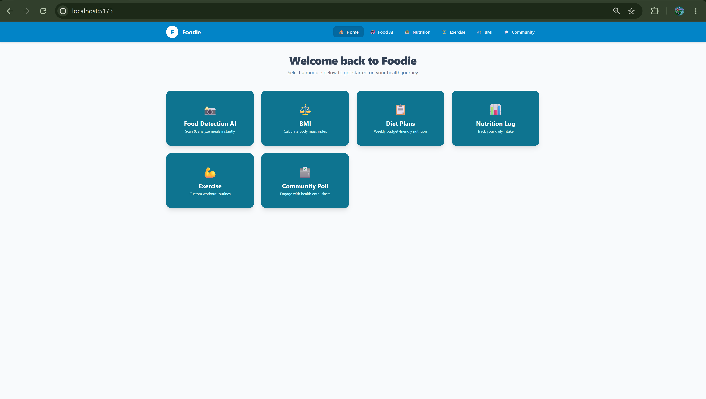
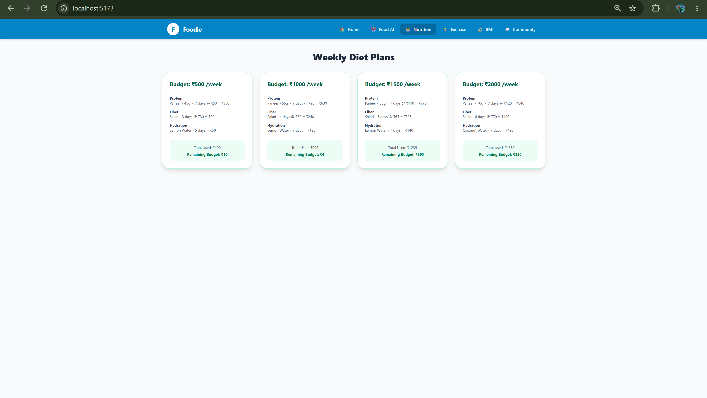
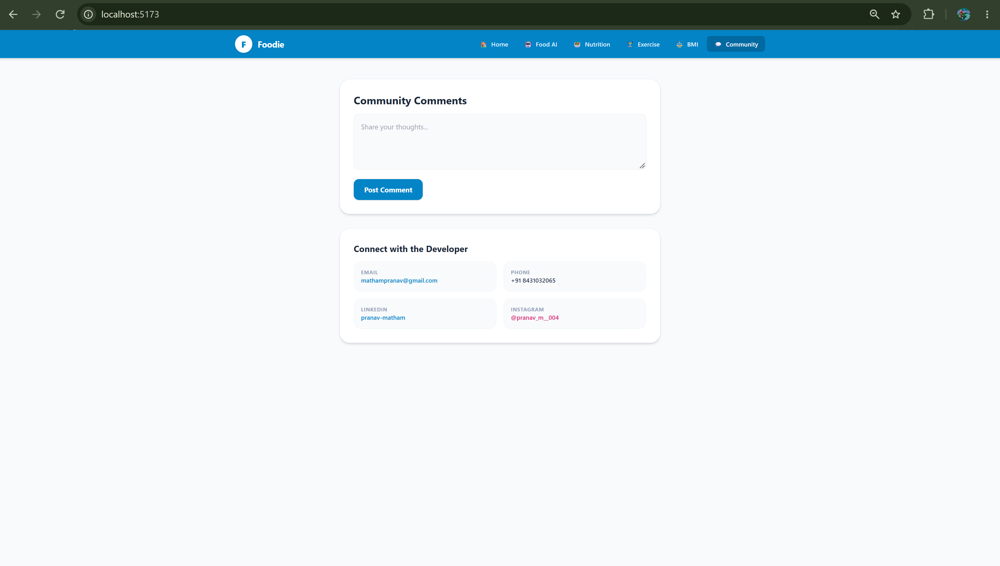

# 🥗 NutriScan-AI: Smart Food Detection & Fitness Ecosystem

NutriScan-AI is a high-fidelity, modular, light-themed full-stack web application designed to bridge 
AI-powered food recognition with personalized nutrition tracking and comprehensive fitness management.

---

## 📁 Project Structure

```text
NutriScan-AI/
├── Backend/
│   ├── main.py
│   └── requirements.txt
├── Frontend/
│   ├── public/
│   ├── src/
│   └── package.json
└── README.md

```
🗄️ Core Components & Architecture
🏠 Home Dashboard
| Component                 | Description                                                          |
| :------------------------ | :------------------------------------------------------------------- |
| **Dashboard Overview**    | Provides an interactive overview of the application's major features |
| **Quick Access**          | Provides shortcuts to key application modules                        |
| **Metric Summary**        | Displays relevant nutrition and fitness metrics                      |
| **Developer Information** | Provides developer credentials and contact information               |


🤖 Food AI Detection
| Component                  | Description                                                   |
| :------------------------- | :------------------------------------------------------------ |
| **Food Image Input**       | Allows users to upload or select food images                  |
| **Intake Wizard**          | Provides a step-by-step food analysis workflow                |
| **Computer Vision**        | Processes food images for recognition                         |
| **Food Recognition**       | Identifies the food represented in the input image            |
| **Nutrition Analysis**     | Provides nutritional information based on the recognized food |
| **Macronutrient Analysis** | Provides information related to nutritional composition       |

🥗 Nutrition Plans
| Component              | Description                                                |
| :--------------------- | :--------------------------------------------------------- |
| **Diet Planning**      | Provides structured nutrition plans                        |
| **Budget-Based Plans** | Generates dietary options based on budget considerations   |
| **Customized Plans**   | Supports personalized dietary planning                     |
| **Cuisine Support**    | Includes Indian and global cuisine options                 |
| **Nutrition Goals**    | Organizes dietary recommendations around user requirements |

🏋️‍♂️ Exercise Routines
| Component              | Description                                               |
| :--------------------- | :-------------------------------------------------------- |
| **Goal Selection**     | Supports Weight Loss, Muscle Gain, and Endurance goals    |
| **Workout Plans**      | Provides goal-based exercise routines                     |
| **Warm-Up Guidance**   | Includes warm-up and stretching information               |
| **Exercise Details**   | Displays detailed information for individual exercises    |
| **Sets & Routines**    | Provides workout set information                          |
| **Calorie Metrics**    | Displays calorie-burn information                         |
| **Interactive Popups** | Presents exercise details through interactive UI elements |

⚖️ BMI Calculator
| Component           | Description                             |
| :------------------ | :-------------------------------------- |
| **Height Input**    | Accepts custom user height              |
| **Weight Input**    | Accepts custom user weight              |
| **BMI Calculation** | Calculates Body Mass Index in real time |
| **Result Display**  | Displays the calculated BMI value       |

💬 Community & Developer Contact
| Component             | Description                                         |
| :-------------------- | :-------------------------------------------------- |
| **Community Section** | Provides an interactive feedback and community area |
| **Feedback**          | Allows users to share their thoughts                |
| **Developer Contact** | Provides direct developer contact options           |
| **Social Links**      | Provides links to developer social profiles         |

🧠 AI & Food Recognition Architecture
| Stage                 | Implementation                                                   |
| :-------------------- | :--------------------------------------------------------------- |
| **Food Image Input**  | Upload or select a food image                                    |
| **Image Processing**  | Computer vision-based image processing                           |
| **Feature Analysis**  | Image features processed by the AI pipeline                      |
| **Food Recognition**  | Identifies the food from the input image                         |
| **Nutrition Mapping** | Maps the recognized food to nutritional information              |
| **Macro Analysis**    | Provides nutritional and macronutrient information               |
| **Result Display**    | Presents the analyzed food and nutrition information to the user |

```
🔄 Application Flow
User opens the NutriScan-AI application.
User accesses the Home Dashboard.
User selects a required module.
For food analysis, the user uploads or selects a food image.
The image is processed through the computer vision pipeline.
The system identifies the food.
Nutritional information and macronutrient details are generated.
Users can explore personalized Nutrition Plans.
Users can select fitness goals and access Exercise Routines.
Users can calculate BMI using custom height and weight values.
Users can access the Community and Developer Contact sections.
```
✨ Key Features & Modules
| Feature / Module                     | Description                                                                                   |
| :----------------------------------- | :-------------------------------------------------------------------------------------------- |
| **🏠 Home Dashboard**                | Interactive overview with quick-access shortcuts, metric summaries, and developer credentials |
| **🤖 Food AI Detection**             | Step-by-step intake workflow for analyzing food images using computer vision                  |
| **🥗 Nutrition Plans**               | Budget-based and customized dietary plans supporting Indian and global cuisines               |
| **🏋️‍♂️ Exercise Routines**         | Goal-based fitness module supporting Weight Loss, Muscle Gain, and Endurance                  |
| **⚖️ BMI Calculator**                | Real-time BMI calculation using custom height and weight inputs                               |
| **💬 Community & Developer Contact** | Interactive feedback section with direct developer and social links                           |

🚀 Tech Stack
| Category            | Technologies / Tools            |
| :------------------ | :------------------------------ |
| **Frontend**        | React, Vite                     |
| **Styling**         | Tailwind CSS                    |
| **UI/UX**           | Modern Glassmorphic UI/UX       |
| **Backend**         | Python, Flask, FastAPI          |
| **Computer Vision** | OpenCV                          |
| **Deep Learning**   | PyTorch, EfficientNet-B0        |
| **Database**        | SQLite                          |
| **Storage**         | Hive, Relational SQL structures |
| **Version Control** | Git, GitHub                     |

```
⚙️ Setup & Local Development
1. Clone the Repository
git clone https://github.com/PRANAV-MS25/NutriScan-AI.git
cd NutriScan-AI
2. Run the Frontend
cd Frontend
npm install
npm run dev
3. Run the Backend

Open a new terminal and run:

cd Backend
pip install -r requirements.txt
python main.py

```
## 📸 UI Preview & Dashboard Walkthrough

| **Smart Dashboard** | **AI Food Recognition** | **Nutrition Analytics** |
| :---: | :---: | :---: |
|  |  |  |
| *Overview of daily intake and metrics* | *Dynamic visual meal recognition scanner* | *Detailed macro breakdowns and targets* |

| **Community Hub** | **Workout & Fitness Planner** |
| :---: | :---: |
|  |  |
| *Engage, share thoughts, and connect* | *Manage workouts and active routines* |


🎯 Project Highlights
| Area                    | Implementation                                            |
| :---------------------- | :-------------------------------------------------------- |
| **AI Food Recognition** | Computer vision-based food image analysis                 |
| **Nutrition Analysis**  | Food-based nutritional and macronutrient information      |
| **Diet Planning**       | Budget-based and customized nutrition plans               |
| **Fitness Management**  | Goal-based workout and exercise routines                  |
| **BMI Analysis**        | Real-time BMI calculation                                 |
| **Exercise Guidance**   | Warm-ups, sets, exercise details and calorie-burn metrics |
| **Community**           | Interactive feedback and community section                |
| **Developer Contact**   | Direct developer and social profile links                 |
| **UI/UX**               | Light-themed modern glassmorphic interface                |
| **Architecture**        | Full-stack frontend and backend application               |

👨‍💻 Developer & Contact
| Contact       | Details                                                                                 |
| :------------ | :-------------------------------------------------------------------------------------- |
| **Email**     | [mathampranav@gmail.com](mailto:mathampranav@gmail.com)                                 |
| **Phone**     | +91 8431032065                                                                          |
| **LinkedIn**  | [pranav-matham](https://www.linkedin.com/in/pranav-matham/)                             |
| **Instagram** | [@pranav_m__004](https://www.instagram.com/pranav_m__004?stkn=MXB0OXIyZjFrYmVrag%3D%3D) |

```
🌐 Repository

GitHub Repository: PRANAV-MS25/NutriScan-AI

© 2026 Pranav Matham. All rights reserved.


